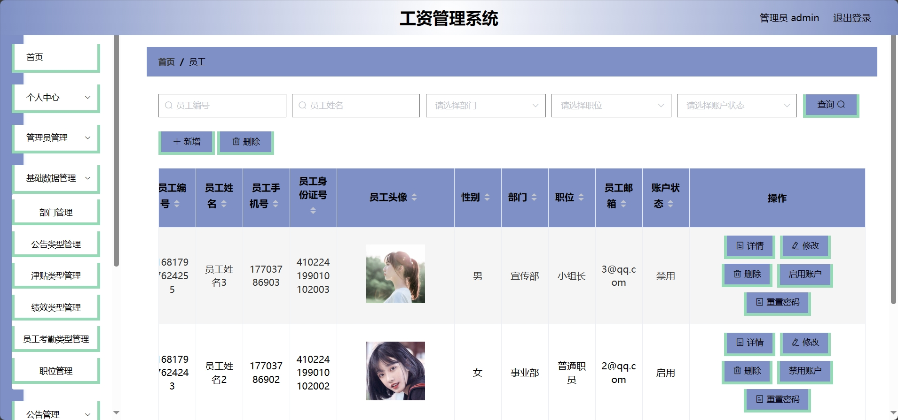
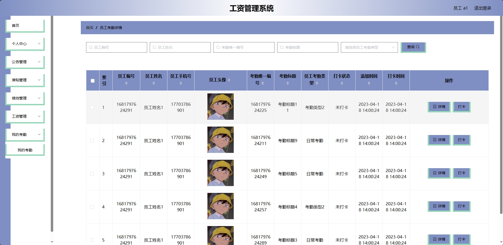
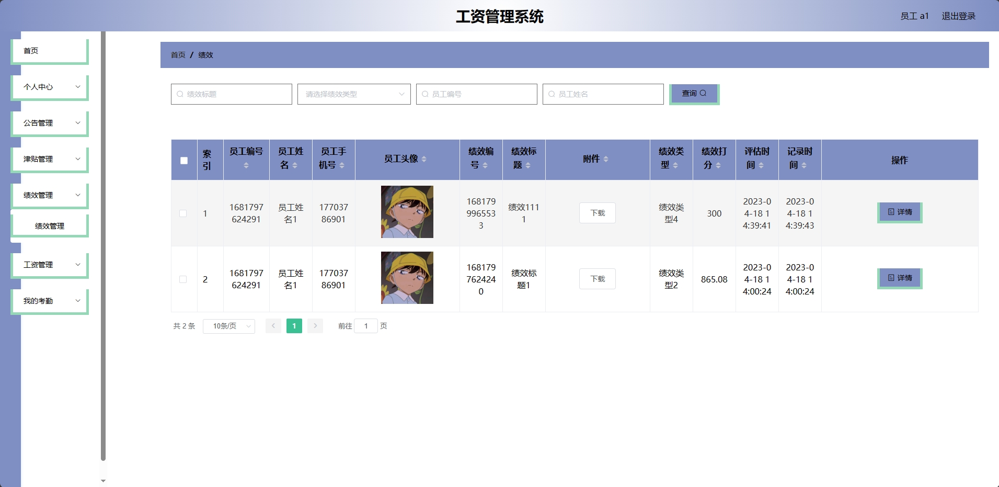
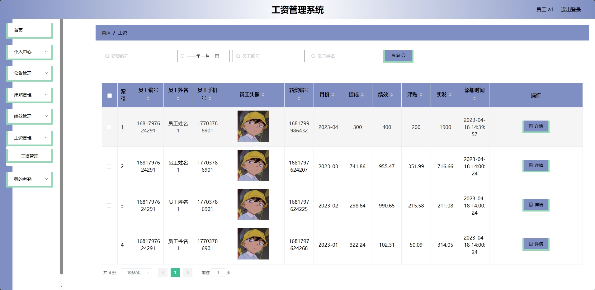
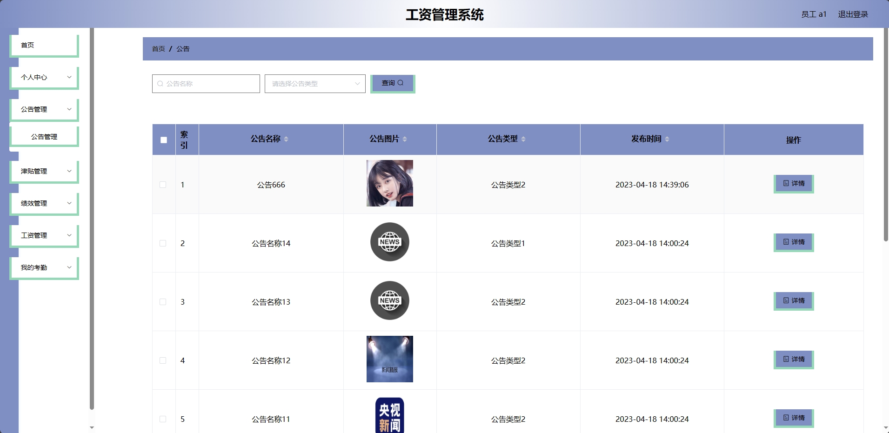
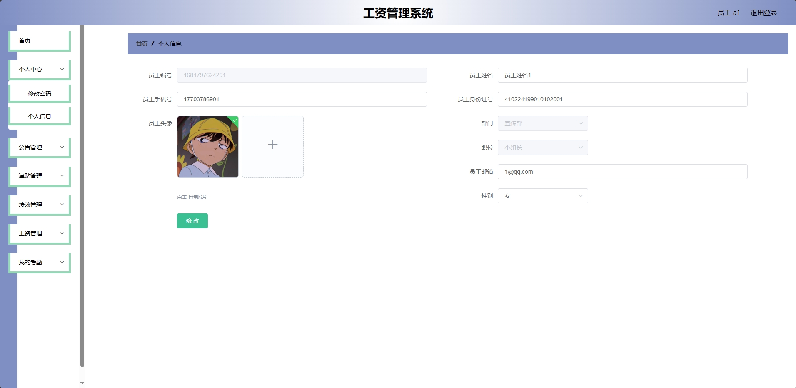

<h1 align="center">基于SSM的工资管理系统</h1>

 获取sql文件 QQ: 3645296857 QQ群: 978300347 

<h4> 需要视频演示可联系上述QQ，私发视频链接 </h4>

 获取更多高质量源码，请访问：[mzoo源码网](https://mzoocodes.com/)

## 简介

> 本代码来源于网络,仅供学习参考使用!
>
> <b style="color: dodgerblue"> 提供1.远程部署/2.修改代码/3.定制程序/4.文档指导/5.框架代码讲解、技术解答、代码讲解等服务 </b>
>
> 管理端首页：http://localhost:8081/
>
> 管理员: admin 密码: 123456
>
> 员工：a1 密码：123456

## 项目介绍

基于SSM的工资管理系统：前端 Vue、ElementUI，后端 SpringBoot、Mybatis，系统角色分为：管理员和员工，管理员在管理后台管理员工绩效，津贴和工资管理，对公告进行发布，员工考勤情况管理等；员工 进行上班打卡，对自己的津贴、绩效和工资进行查看，附件信息下载等。主要功能如下：

### 管理员：

- 基本操作：登录、修改密码、修改个人信息、上传图片、获取个人信息、报表、重置密码、上传附件
- 管理员管理：获取管理员列表、筛选管理员信息、修改管理员信息、删除管理员信息、添加管理员信息、查看管理员信息详情
- 部门管理：获取部门列表、筛选部门信息、删除部门信息、编辑部门信息、查看部门信息详情
- 公告管理：获取公告列表、筛选公告信息、删除公告信息、发布公告、修改公告内容、删除公告信息
- 公告类型管理：获取公告类型列表、筛选公告类型信息、删除公告类型信息、发布公告类型、修改公告类型内容、删除公告类型信息
- 职位管理：获取职位列表、筛选职位信息、删除职位信息、发布职位、修改职位内容、删除职位信息
- 津贴管理：获取津贴列表、筛选津贴信息、删除津贴信息、发布津贴、修改津贴内容、删除津贴信息
- 津贴类型管理：获取津贴类型列表、筛选津贴类型信息、删除津贴类型信息、发布津贴类型、修改津贴类型内容、删除津贴类型信息
- 绩效类型管理：获取绩效类型列表、筛选绩效类型信息、删除绩效类型信息、发布绩效类型、修改绩效类型内容、删除绩效类型信息
- 考勤类型管理：获取考勤类型列表、筛选考勤类型信息、删除考勤类型信息、发布考勤类型、修改考勤类型内容、删除考勤类型信息
- 工资管理：获取工资列表、筛选工资信息、删除工资信息、发布工资、修改工资内容、删除工资信息、工资报表
- 考勤任务管理：获取考勤任务列表、筛选考勤任务信息、删除考勤任务信息、发布考勤任务、修改考勤任务内容、删除考勤任务信息
- 员工考勤管理：获取员工考勤列表、筛选员工考勤信息、删除员工考勤信息、删除员工考勤信息
- 员工管理：获取员工列表、筛选员工信息、修改员工信息、删除员工信息、添加员工信息、查看员工信息详情、启用员工

### 员工：

- 基本操作：登录、修改密码、修改个人信息、上传图片、获取个人信息
- 公告管理：获取公告列表、筛选公告信息、查看公告详情
- 津贴管理：获取工资列表、筛选工资信息、查看工资详情、下载附件
- 绩效管理：获取绩效列表、筛选绩效信息、查看绩效详情、下载附件
- 工资管理：获取工资列表、筛选工资信息、查看工资详情
- 考勤管理：获取考勤列表、筛选考勤信息、查看考勤详情、考勤打卡

## 环境

- <b>IntelliJ IDEA 2020.3</b>

- <b>Mysql 5.7.26</b>

- <b>NodeJs 14.17.3</b>

- <b>Maven 3.6.3</b>

- <b>JDK 1.8</b>

## 运行截图

